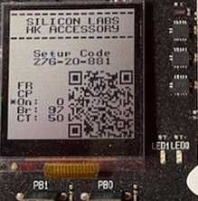
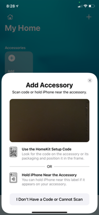
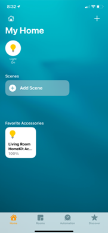
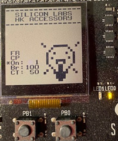
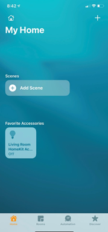
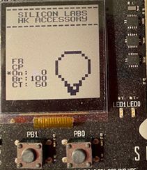

# HomeKit DMP - SoC Lightbulb

A Lightbulb application configured for HomeKit over Bluetooth LE and OpenThread. Per the HomeKit specification designed by Apple, it only operates over one stack at a time during runtime. By default, unless OpenThread Static Commissioning is enabled, the application will boot into HomeKit over Bluetooth LE. The functionality will be the same as HomeKit over Bluetooth LE.

After pairing over Bluetooth LE, the user will then be able to send the OpenThread network parameters as a message, and the device will switch to HomeKit over OpenThread and attempt to join on OpenThread with the parameters given. If no network with the parameters is found or successfully joined, it will eventually revert back to HomeKit over Bluetooth LE. If it joins the OpenThread network successfully, the device should still be paired as long as the controlling device (such as the HomeKit Accessory Tester (HAT) tool or the HomePod Mini) is OpenThread-capable. The user can then control the device over HomeKit on OpenThread.

If you are not familiar with the HomeKit SDK, see QSG179: HomeKit SDK Quick-Start Guide.

## Authentication Methods for HomeKit

*   Default Authentication -
    The default authentication mode is to use no authentication, and thus the device is uncertified. This is intended to be used only for development. All certified HomeKit devices in the field must have either software or hardware authentication. 
*   Software Authentication - 
    The HomeKit process for software authentication uses an authentication token flashed to NVM3 non-volatile memory. No changes in the project configuration are required. While pairing with an accessory using software authentication, the controller must have an Internet connection. The token changes every time the pair setup process completes successfully. Refer to Software Authentication documentation provided by Apple for additional details on setup.
*   Hardware Authentication - 
    Hardware authentication requires an Apple Authentication Coprocessor hardwired to the accessory. Inter-Integrated Circuit (I2C) is required to communicate with it. The next section explains how to configure a project to use the MFi chip to authenticate a device. 

For more information about authentication methods, see UG493: HomeKit SDK Developer's Guide.


## Testing the HomeKit DMP - SoC Lightbulb Application with HomePod Mini

1. Build and flash the HomeKit DMP - SoC Lightbulb example to your device.
2. Make sure a bootloader is installed. See the Troubleshooting section.
3. When the application starts on the device, the LCD displays a setup QR code.



4. Add a HomePod Mini to your Home. This creates a Thread network unique to your iCloud account for this Home.

5. Using an iOS device (14.1 or newer), add the accessory to your Home using the Home app. The Home app writes the Thread credentials to the accessory over Bluetooth LE. 

5.1. In the Home App, tap Add Accessory.
5.2. Scan the QR code OR tap I Don’t have a Code or Cannot Scan. If you select Manual Code, enter the setup code displayed on the LCD. If the display is not available, use the static setup code (by default “111-22-333”). Then wait for the pairing process to complete. 



5.3. Tap Add to Home.

5.4. If you get an Uncertified Accessory warning, tap Add Anyway. You will get this warning if you are not using either Hardware or Software Authentication. The process for adding this functionality is described in AN1327: Configuring a Project in the HomeKit SDK.
5.5. Provide a Light Location and Light Name. The light gets added as a tile in the main screen of the app.
5.6. Tap the tile to turn the light on. Tap again to turn it off. On the mainboard, both a graphic on the LCD and LED0 respond.

 

 

6. The accessory should join your HomePod Mini’s Thread network. (Confirm using Thread Discover View in HAT Trace or by running ```dns-sd -B _hap._udp’``` on the Terminal of a Mac connected to the same network as the HomePod Mini.)

7. Remove the accessory from the Home app. This should remove HomeKit pairings from the accessory, but it should remain on the Thread network in an ‘Unpaired’ state.

8. You can proceed with pairing this accessory using Thread Controllers in HAT running on a Mac connected to the same network as the HomePod Mini, as discussed in QSG179: HomeKit SDK Quick-Start Guide.

## Additional Demo Functionality

The mainboard has three buttons: PB1 and PB0 immediately under the LCD, and RESET on the right edge of the board. It also has two LED indicators (LED1 and LED0). The sample application is configured to have a display, through a Display component. In that configuration, the application as provided in the SDK has five menu options:

*   FR - Factory Reset: clears pairings and resets application parameters to default values, generates new setup code and QR code
*   CP - Clear Pairing: clears pairings, all paired devices are removed, generates new setup code and QR code
*   ON - Toggles LED State (ON; OFF)
*   BR - Brightness (onboard LED doesn’t have brightness control feature implemented)
*   CT - Color Temperature
By changing the configuration settings in the Lighting component, you can add or replace BR and CT with the following:
*   Hu – Hue
*   Sa – Saturation
Use PB1 to navigate through the menu options, and PB0 to confirm. For BR, CT, Hu and Sa, the menu pointer has two options:
*   Plus (+):  Increments the value
*  	Minus (-): Decrements the value

## Commissioning a Thread Device to the Thread Network

To connect a Thread Device to the Thread Network, provide the device with Thread Network Credentials. This may be done in three ways.

* Commissioning the Accessory over HAP

If the accessory supports Bluetooth LE, it may be paired over Bluetooth LE and commissioned through the ThreadManagementControl characteristic. The Silicon Labs HomeKit DMP example demonstrates this functionality. See QSG179: HomeKit SDK Quick-Start Guide for further instructions on running this example.

* Static Commissioning

The Silicon Labs HomeKit Thread example demonstrates this functionality by joining a statically-commissioned network. The network parameters for this network are defined in 

extension/homekit/adk/PAL/Thread/OpenThread/HAPPlatformThreadUtils+Commissioning.c

* Joiner Mode 

The ADK may be built such that it boots into 'Joiner Mode'. An accessory in Joiner Mode must be manually commissioned by a node on the Thread network (in this case the Border Router). 


For more information about Commissioning methods see AN1327: Configuring a Project in the HomeKit SDK.

## Troubleshooting


Note that Software Example-based projects do not include a bootloader. However, they are configured to expect a bootloader to be present on the device. To get your application to work, either
- flash a bootloader to the device or
- uninstall the **OTA DFU** and **Bootloader Application Interface** software components.

To flash a bootloader, either create a bootloader project or run a precompiled **Demo** on your device from the Launcher view. Precompiled demos flash both bootloader and application images to the device. Then flash your own application image to overwrite the demo application but leave the bootloader in place. 

- You can create your own bootloader project and flash it to the device before flashing your application.
- When you flash your application image to the device, use the *.hex* or *.s37* output file. Flashing *.bin* files may overwrite (erase) the bootloader.
- On Series 1 devices (EFR32xG1x), both first stage and second stage bootloaders have to be flashed. This can be done in one step by flashing the *-combined.s37* file found in the bootloader project directory after building the project.
- For more information, see [UG103.6: Bootloader Fundamentals](https://www.silabs.com/documents/public/user-guides/ug103-06-fundamentals-bootloading.pdf) and [UG489: Silicon Labs Gecko Bootloader User's Guide for GSDK 4.0 and Higher](https://cn.silabs.com/documents/public/user-guides/ug489-gecko-bootloader-user-guide-gsdk-4.pdf).

Before programming the radio board mounted on the mainboard, make sure the power supply switch is in the AEM position (right side) as shown below.


## Resources
More information about HomeKit applications and the SDK is available in the following, which can be accessed in the Documents tab:

* AN1327: Configuring a Project in the HomeKit SDK
* QSG179: HomeKit SDK Quick-Start Guide
* UG493: HomeKit SDK Developer's Guide


## Report Bugs & Get Support

You are always encouraged and welcome to report any issues you found to us via [Silicon Labs Community](https://www.silabs.com/community).